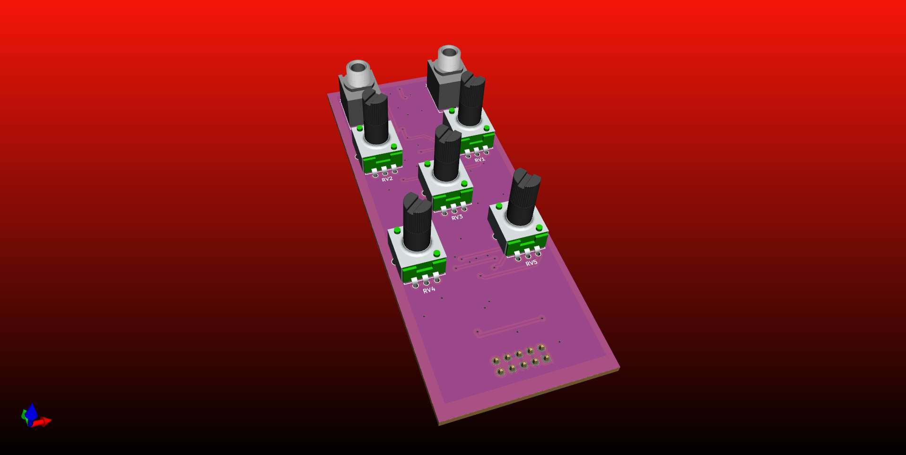
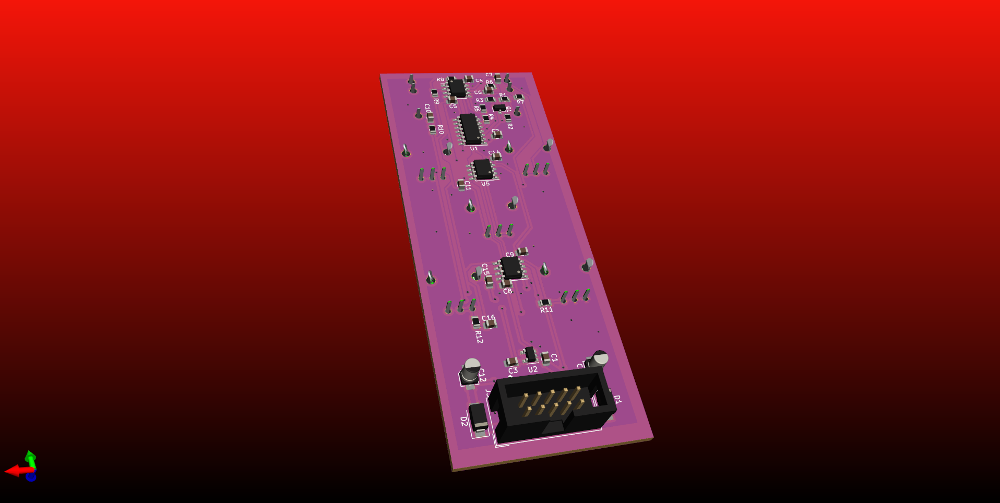
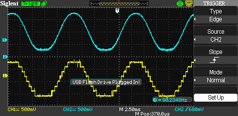
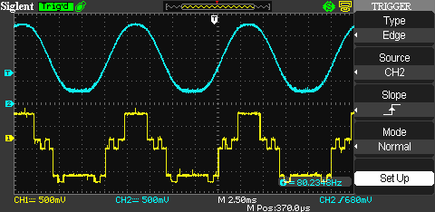
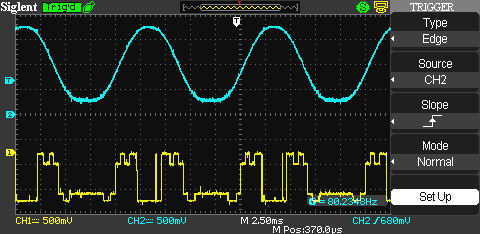
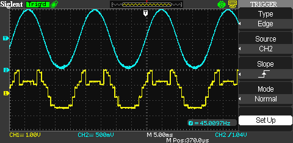

# MMTMM 
Music Makers who Make Music. We're designing and building 100% open source eurorack modules.

## Drum
This is our most active project right now. V2 is finished and off to fab, testing results and sound samples will be in soon! This drum is a classic which takes inspiration from the 808 service manual. This guy has knobs all over the place and a HPF and LPF on the output. Very early stage of the design.

## Logic Crusher
This is a design that conditions synth level audio into 4bit. Then exposes the 4 bits in a breadboard area which allows the user to patch up digital logic. Then the 4bit audio is converted back into the analog domain. It's possible to make some very complex sounds. Here is the overall design...

Some wavforms...

The current setup... (Will be made into a module later.

