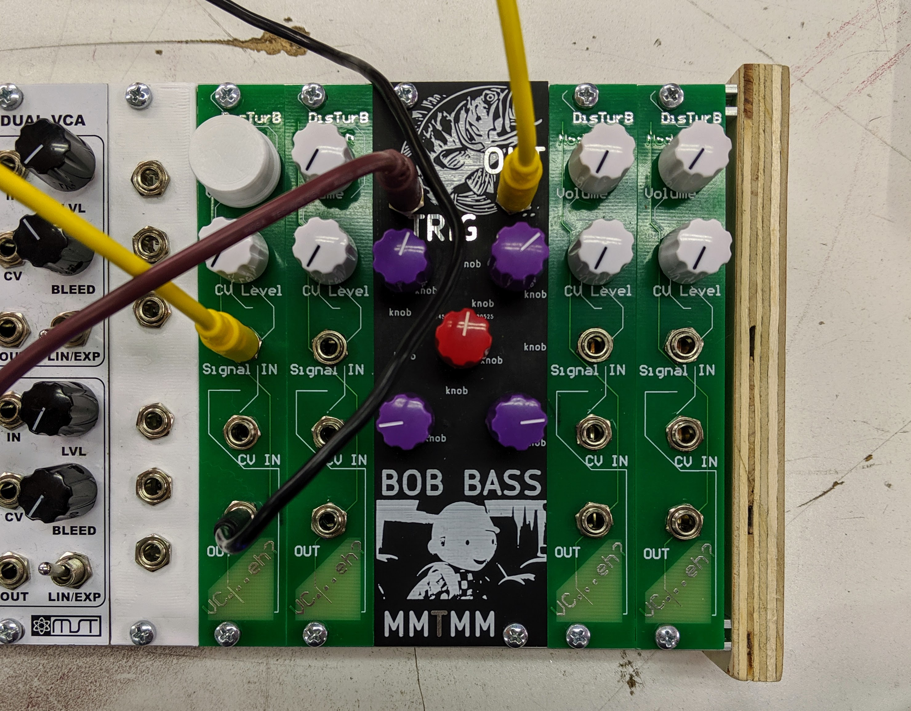
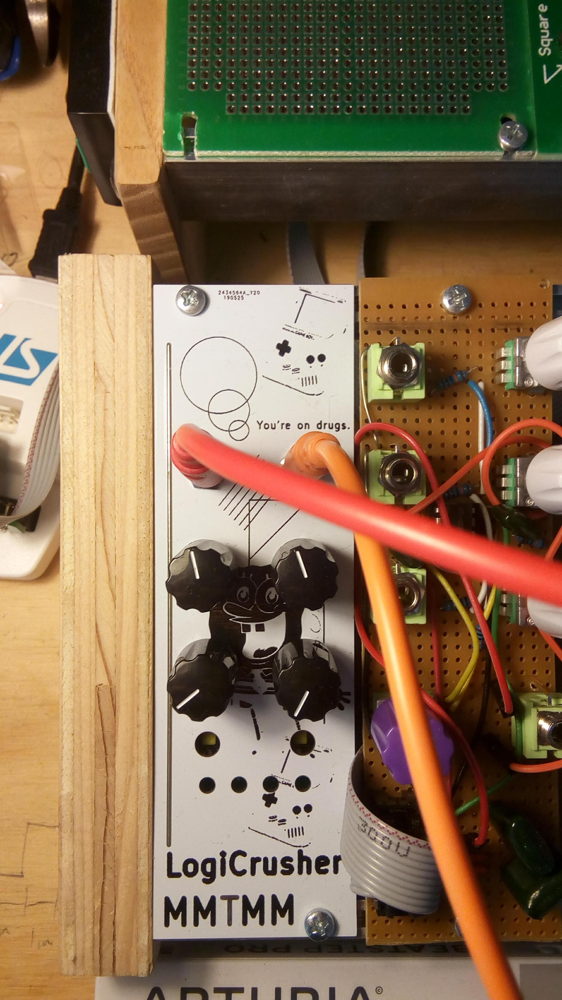

# MMM 
Makers Make Music. We're designing and building 100% open source eurorack modules, we would love to hear [from you](https://docs.google.com/forms/d/e/1FAIpQLSeDmKGT8nFPX62po_9shZNs7qYtOch9zK6xhK_ntmRhs4zbUg/viewform?vc=0&c=0&w=1)! All of our designs are done in kicad, which is an open source PCB design software.

## Drum (Bob Bass)
The [Bob Bass](https://github.com/Machine-Hum/MMTMM/tree/master/DrumModule) takes inspiration from the 808 service manual. This guy has knobs all over the place: HPF, LPF, overdrive and control over the resonance and decay. [AUDIO](https://drive.google.com/file/d/1c2VHwUoPN1qcCgDcaHPTnX8EYp0KqyGa/view?usp=sharing) --- [VIDEO](https://www.youtube.com/watch?v=IFoyo2GT42M)

## Logic Crusher
This is a design that conditions synth level audio into 4bit digital. These signals can then be routed through standard TTL logic and then converted back into audio. It's possible to make some very complex sounds. Here is the faceplate, patching is done through the back of the panel. 
{:height="50%" width="50%"}

Some wavforms, the blue is the input and the yellow is the output.  

The current setup... (Will be made into a module later)

