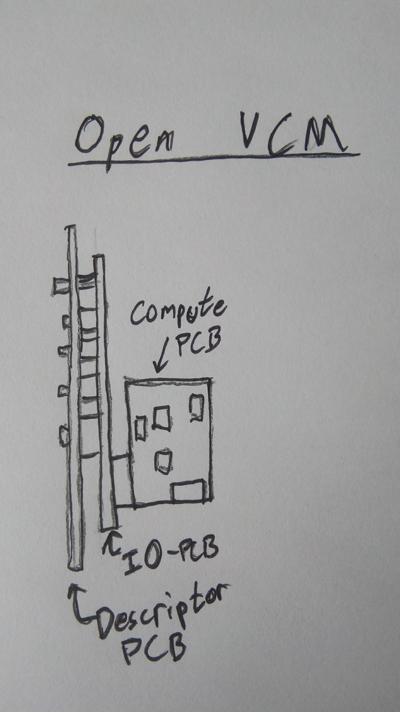

# MMTMM

It's lit.

# Open-VCM ( Very Configurable Module )
The purpose of Open-VCM is to create a low cost platform that's highly configurable. There are three sub-modules that go into the entire module. User can switch them out independently to make entirely different modules.

## Requirements
- Affordable
- Ease of use
- Highly modular
- Completely open source
- One module can serve multiple purposes
- Gate: 0V - OFF, 5V - ON. Will be able to handle +-12V.
- CV: +-5V. Will be able to handle +-12V.

## Architecture
There are three main sub-modules that can be mixed and matched with each other.

1. Compute, this contains anything that does any signal manipulation. This can be an Arduino, STM32 or analog circuitry.
2. Interface-IO, this is anything that the user interacts with, be it knobs, buttons, jacks etc... The Compute PCB connects with the Interface-IO pcb using a backplane connector.
3. Descriptor, this is the front module that bolts to the Interface-IO PCB. It is only mechanically connected and serves to outline what the knobs, jacks and buttons actually do.

## Backplace connector Signals
- Power ( 7x ):           3x GND, 3v3, 5V, +12V, -12V
- DigitalInputs ( 8x )
- DigitalOutput ( 8x ):   DO0 - DO7
- AnalogOutput ( 16x ):   AO0
- AnalogInput ( 16x ):    AI0 - AI7
- SWD (3x):
- USB (2x):
- Bootload PB (1x):

## Signal Description
The compute PCB is responsible for conditioning all signal to a reasonable level. This is done so the compute PCB can be swapped out for a pure analog PCB in the event the user might wish to build an analog module. All inputs to the compute PCB can handle a full +-12V swing. All outputs are standardised such that they will interface with "normal" eurorack modules.

- Power 
  - As outlined. Shrouded power header on compute PCB. 
- DigitalOutput 
  - Signal protocol not defined. 
- DigitalInput
  - Signal protocol not defined. 
- AnalogOutput
  - +-10V from compute PCB. Conditioned up by compute PCB.
- AnalogInput
  - +-10V coming from IO pcb. Conditioned down to 3.3V by compute PCB.

## MVM ( Minimum viable module )
This is an example of a very low cost configuration that has the highest flexibility. A user could build 5+ of these and change the firmware on each module resulting in a 5 completely different modules.

- Compute Module
  - Arduino / STM32
    - 8x Channels for ADC
    - 1x Channels for DAC
  - All required conditioning circuitry

- IO Module
  - Digital
    - 8x LEDs, doubled with digital output jacks
    - 2x Digital In Jacks
    - 4x Buttons
  - Analog
    - 1x Analog Out Jacks
    - 8x Analog In Jacks, doubled with Pots

- Description Module
  - Option 1: 5x same PCBs for all modules: Labelling their technical names ie: AO0, DI, etc... The user will have to know the specifics. 
  - Option 2: Order 5x different description modules that label the IO with the functional name, ie: CV/Gate/Output etc... This is a cost trade-off.
  
- Applications
  - VCO
  - VCF
  - Sequencer
  - VCA
  - Divider
  - Sampler
  - etc ...
  
  ## Advantage
  The advantages of a system like this are as follows.
  - Economy of scale
    - Expensive parts are groups into modules that can be manufactured in volume. The compute PCB is that same across a wide spectrum of modules.
  - Simplicity of assembly
    - SMT parts are grouped into your compute module. Which can be purchased, as economy of scale exists these parts should be cheap.
    - IO modules are hand-solderable W/O the need for SMD skills.
    - Description modules require zero soldering.
  - Configure-ability
    - Users have the ability to mix and match their compute/IO/Desc modules as they wish. If the wish to upgrate an existing compute module to an analog module, they now have their old compute module for something completely different.
  - Entrance-ability
    - Users are able to enter the modular scene without selling limbs, as it's possible to purchases multiple MVM's and firmware flash them for different purposes. Later on, as they wish to upgrade they can purchase additional modules and descriptors to customise their rack further.
  - Community project.
  
